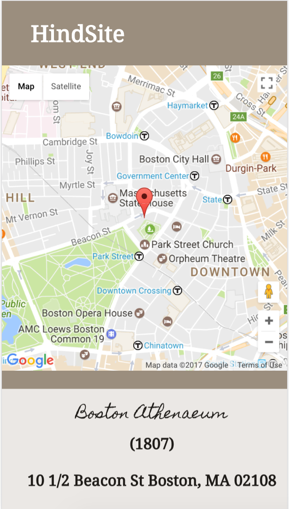

 
 # Hindsite

HindSite is a mobile-friendly history app that allows users to locate all the historical places nearby using the Google Maps Geolocation API. Users can also add historical places and events. Using Google Maps Javascript API, users can view pinpoints of all added locations and create day trips using those events. By incorporating the Google Maps Directions API, users can view directions for their historical day trips.  

  

I am convinced there are two types of people in this world: people who love history and people who don't know they love history yet. My goal in building this app was to make history more accessible and fun using technology. Users can add their own events or places they believe have historical significance. By allowing people to create their own history, I hope to convince those who think history is boring that there is so much about history to love.

## Getting Started

### This project uses the following technologies:

* Ruby 2.2.5
* Rails 5
* PostgreSQL
* React
* Google Maps Javascript API
* Google Maps Directions API
* Google Maps Geolocation API
* Geocoder
* Fetch
* Javascript
* Foundation

## Demo

Visit [HindSite](https://hind-site.herokuapp.com/)

Sign is as a guest:

```
guest@hindsite.com
guest123
```

## Set up Rails

```
git clone https://github.com/aimeebachari/hindsite
bundle install
rake db:create
rake db:migrate
```

## Set up Webpack

```
npm install
```

## Run the application

Run the following commands in your terminal from the directory:

`rails s
npm start`

Open the browser and enter `localhost:3000`.

## Testing

To run the test suite, type `rake` in the terminal.
